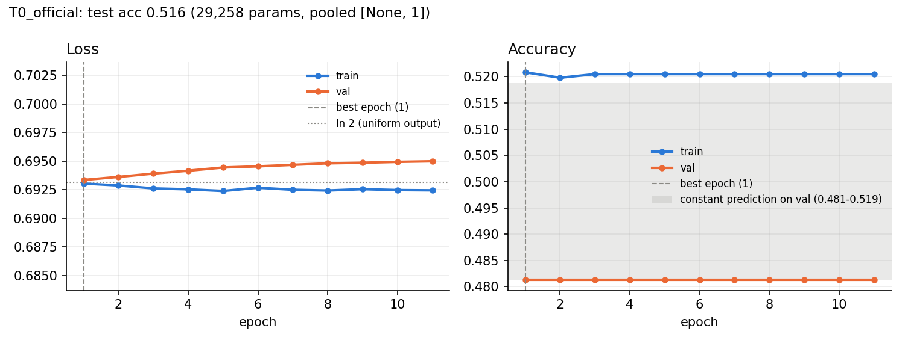
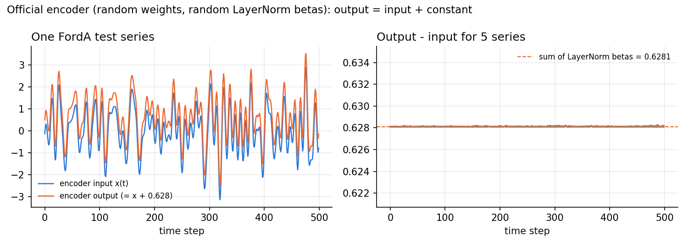
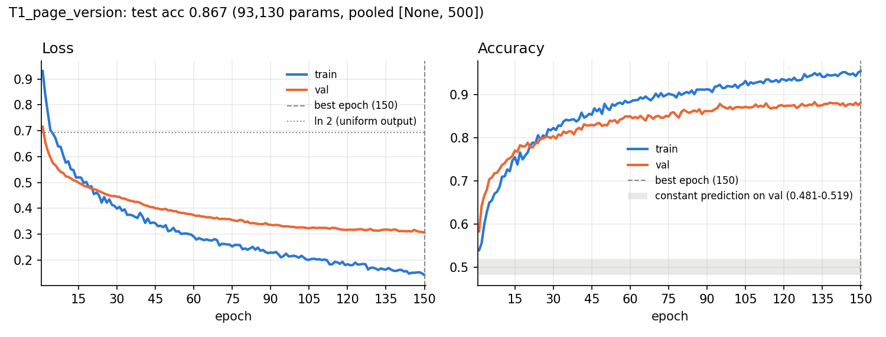
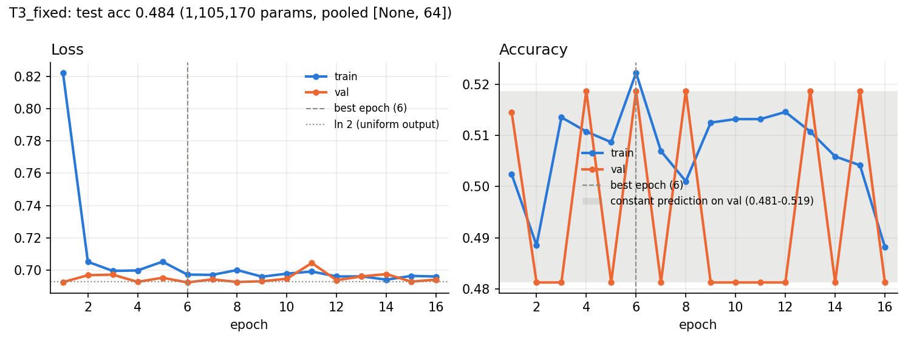
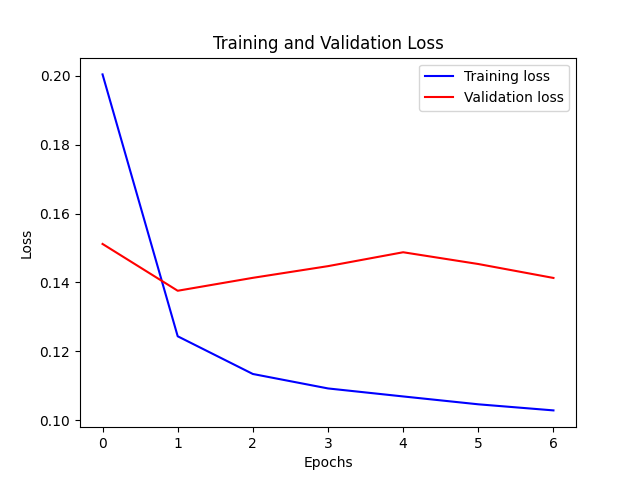
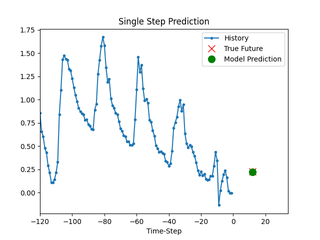
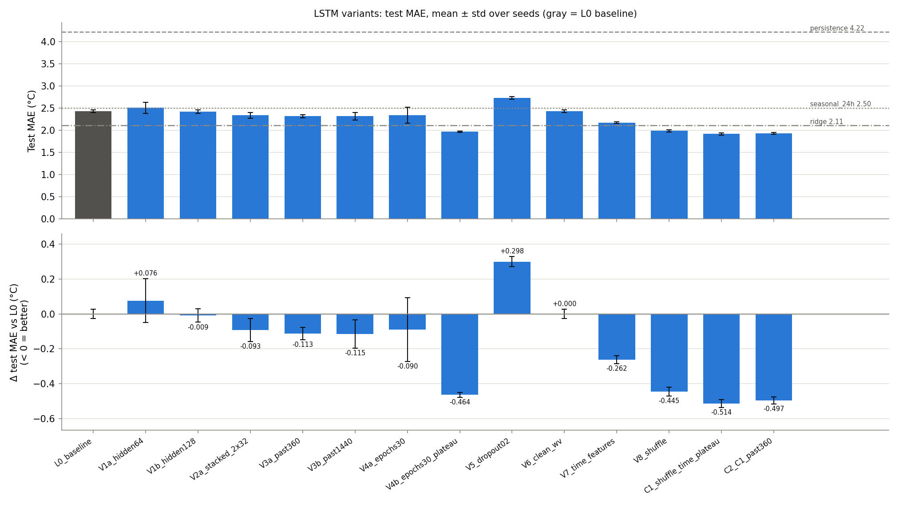
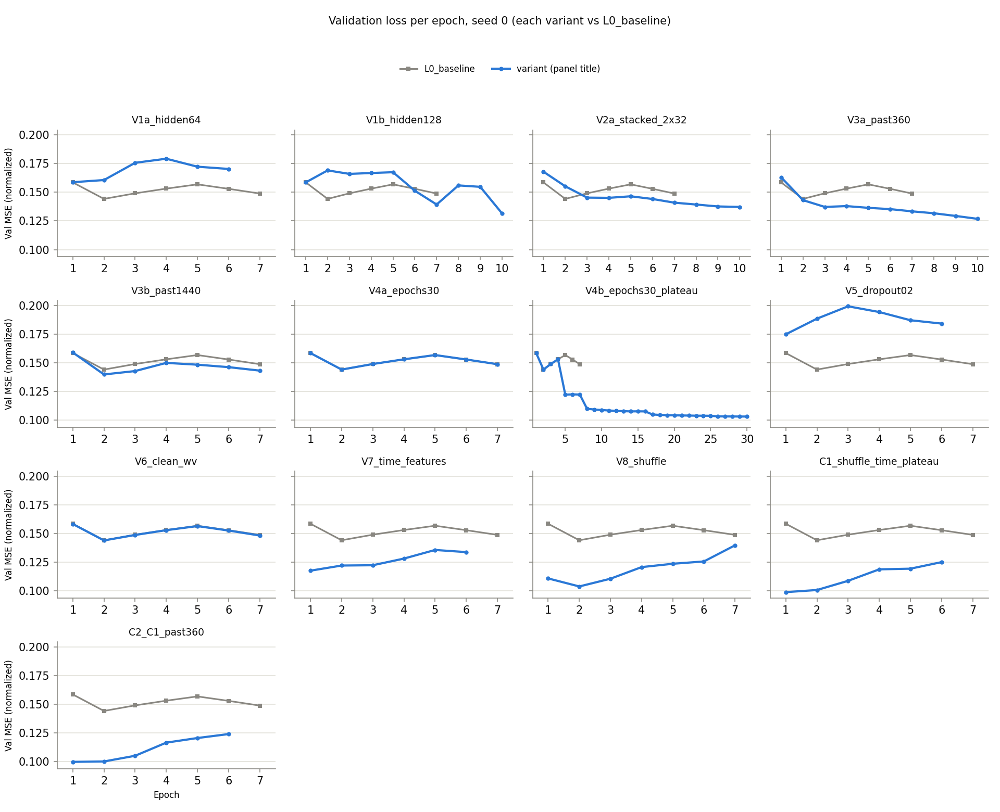

# CMPE 401 Project 2: Time-Series Benchmark (Transformer on FordA, LSTM on Jena Climate)

**Authors:** Cole Robulack, Ezra Krause

CMPE 401 (UBC Okanagan), Instructor-defined Project 2. We reproduced both official Keras time-series examples on a Colab T4 GPU and benchmarked controlled changes to the LSTM.

The Transformer example as it currently stands on keras-io master trains to chance. Its test accuracy is 0.516, exactly the majority-class rate, and it puts every test series in the same class. We traced this to two shape problems that act together: pooling over time collapses each z-normalized series to one constant, and a LayerNorm over a single feature turns every encoder block into `x + constant`. The ~85 % accuracy published on keras.io comes from an older version in which the encoder also contributes nothing. Deleting the encoder gives 0.873 in 1/45 of the training time.

For the LSTM, we moved the official model onto a leak-free train/val/test protocol. On that protocol, a ridge regression on the same inputs beats it (2.11 vs 2.43 °C test MAE). We then ran 11 single changes with 3 seeds each. Shuffling the training windows, a plateau learning-rate schedule (with a 30-epoch budget) and calendar features helped most. Combined (C1), they reach 1.92 ± 0.02 °C, 21 % below the baseline and 9 % below ridge. C1's selected weights come from epoch 1, before the schedule acts, so its result is due to shuffling and calendar features.

## Key results

| Task | Experiment | Evaluated on | Metric | Result |
|---|---|---|---|---|
| 1 | T0: official Transformer, current keras-io code | FordA test (1,320 series) | accuracy | **0.516** (majority-class rate: 0.516) |
| 1 (diagnostic) | T1: T0 with the pre-2024 pooling (the code that produced the output shown on keras.io) | FordA test | accuracy | 0.867 |
| 1 (diagnostic) | T2: T1 with all four encoder blocks removed | FordA test | accuracy | 0.873 (fit in 55 s vs 41 min) |
| 1 | L0_official: official LSTM, official split | official validation rows | MAE °C, best checkpoint / last epoch | 2.506 / 2.540 |
| 2 (baseline) | L0_baseline: official LSTM on the leak-free protocol | held-out test | MAE °C, mean ± std over 3 seeds | 2.430 ± 0.027 |
| 2 (reference) | Ridge regression on the same 120×7 input window | held-out test | MAE °C | 2.112 |
| 2 | **C1: L0 + shuffling + time features + 30 epochs/plateau LR (final model; the schedule never acted before the selected epoch 1)** | held-out test | MAE °C, mean ± std over 3 seeds | **1.916 ± 0.022** (-21.1 % vs L0) |

T1 and T2 are Task 1 diagnostics that explain T0's result, not Task 2 modifications. Task 2 is the LSTM only.

## Contents

- [Assignment map](#assignment-map)
- [Setup and reproducibility](#setup-and-reproducibility)
- [Datasets](#datasets)
- [Classification vs forecasting, Transformer vs LSTM](#classification-vs-forecasting-transformer-vs-lstm)
- [Task 1a: Transformer reproduction (FordA)](#task-1a-transformer-reproduction-forda)
- [Task 1b: LSTM reproduction (Jena Climate)](#task-1b-lstm-reproduction-jena-climate)
- [Task 2: LSTM improvement benchmark](#task-2-lstm-improvement-benchmark)
- [Task 3: Benchmark summary](#task-3-benchmark-summary)
- [Task 4: Questions](#task-4-questions)
- [Limitations and next steps](#limitations-and-next-steps)
- [Repository layout](#repository-layout)

## Assignment map

| Task (spec §5) | Section | Code | Results |
|---|---|---|---|
| **Task 1**: run both baselines, train them, record observations | [Task 1a](#task-1a-transformer-reproduction-forda), [Task 1b](#task-1b-lstm-reproduction-jena-climate) | `experiments/transformer_official.py`, `transformer_probe.py`, `transformer_fixed.py`, `lstm_official.py` | `results/transformer/`, `results/lstm/L0_official/` |
| **Task 2**: at least 3 meaningful modifications to one model (we chose the LSTM) | [Task 2](#task-2-lstm-improvement-benchmark) | `experiments/jena_data.py`, `lstm_benchmark.py`, `naive_baselines.py` | `results/lstm_benchmark/` |
| **Task 3**: benchmark-style summary | [Task 3](#task-3-benchmark-summary) (the full table is in Task 2) | `experiments/aggregate_lstm.py` | `results/lstm_benchmark/summary.md`, `summary.csv`, `test_mae.png` |
| **Task 4**: "Which model did you find easier to understand and why?" and "What improvement did you try, and what did you learn from it?" | [Task 4](#task-4-questions) | | |

| Objective (spec §3) | Where |
|---|---|
| 1. Classification vs forecasting | [Classification vs forecasting, Transformer vs LSTM](#classification-vs-forecasting-transformer-vs-lstm), [Datasets](#datasets) |
| 2. Transformer vs LSTM | [Classification vs forecasting, Transformer vs LSTM](#classification-vs-forecasting-transformer-vs-lstm), [Task 4](#task-4-questions) |
| 3. Reproduce and run the official examples | [Task 1a](#task-1a-transformer-reproduction-forda), [Task 1b](#task-1b-lstm-reproduction-jena-climate) |
| 4. Dataset, input, output, training process, metrics | [Datasets](#datasets), [Classification vs forecasting, Transformer vs LSTM](#classification-vs-forecasting-transformer-vs-lstm), the model descriptions in Task 1a and Task 1b |
| 5. Small benchmark through controlled changes | [Task 2](#task-2-lstm-improvement-benchmark) |
| 6. One reasonable improvement to one baseline | [Task 2](#task-2-lstm-improvement-benchmark) (C1) |
| 7. Clean README-style project on GitHub | this README, `results/`, [Repository layout](#repository-layout) |

## Setup and reproducibility

| | Reported runs | Local code testing |
|---|---|---|
| Hardware | Google Colab, NVIDIA Tesla T4 | macOS arm64, CPU only |
| Python | 3.13.15 | 3.12 |
| TensorFlow / Keras | 2.20.0 / 3.13.2 (Colab's preinstalled versions) | 2.21.0 / 3.15.1 (`requirements.txt`) |
| Other | NumPy 2.1.3, pandas 2.2.3, scikit-learn 1.6.1 | see `requirements.txt` |

Every experimental result in this README comes from a file under `results/`. The exceptions are the other-execution column of the duplicate-run table below (observed live, not saved), figures quoted from the keras.io pages, and dataset facts computed from the raw files in `data/` (class counts, date ranges, timestamp irregularities, sentinel rows and window counts). Each run's `summary.json` or `seed*.json` records the library versions and that a GPU was used (`/device:GPU:0`). The GPU model (Tesla T4) comes from the Colab runtime (the notebook's `nvidia-smi` cell) and is not stored in the files. The Mac was used only to test the code.

**Seeds.**
- Transformer runs T0-T3 use seed 42. The seed is set before the example shuffles the training data, so all four runs use the same 2,880/721 fit/validation split.
- L0_official uses seed 0.
- Every LSTM benchmark configuration runs with seeds 0, 1 and 2. The ridge baseline's training subsample uses seed 0.
- In the LSTM benchmark, a given seed was reproducible bit-for-bit on the T4 whenever the effective training was the same. For example, V6 and seeds 0-1 of V4a report exactly L0's test MAE, and V4b's epochs 1-4 match L0's exactly ([Task 2](#task-2-lstm-improvement-benchmark) explains why).
- The Transformer runs were not bit-for-bit reproducible. Running them again with seed 42 changed T2 by 3 test series and moved T3's stopping epoch (see Execution notes). They use XLA (`jit_compile: true`), and no script enables deterministic GPU ops.

**Colab (how the reported results were produced).** Open [`notebooks/colab_P2.ipynb`](notebooks/colab_P2.ipynb) in Colab ([direct link](https://colab.research.google.com/github/EzraKrause04/CMPE-401---Instructor-Defined-Project-2/blob/main/notebooks/colab_P2.ipynb)), select a T4 GPU and choose **Run all**.
- With `PERSIST_TO_DRIVE = True`, results, weights and data are kept in `MyDrive/cmpe401-p2/`.
- A re-run skips finished runs: an interrupted Transformer run resumes after its last completed epoch, and the LSTM benchmark continues from the last finished (variant, seed) pair.
- The last cell zips `results/` for download.

**Retraining from scratch.** The committed `results/` act as finished-run markers, so **Run all** on a fresh clone skips every run and trains nothing (the notebook copies the clone's `results/` onto Drive, then skips each run whose finished-run file, such as `summary.json`, `probe.json` or `seed*.json`, exists). To retrain, move the committed results aside first: in Colab, add a cell with `!mv results results_committed` after the clone cell and use an empty Drive folder (rename or delete `MyDrive/cmpe401-p2/results`); locally, run `mv results results_committed`.

**Locally.**

```bash
pip install -r requirements.txt

# Task 1a: Transformer / FordA (seed 42 by default)
python experiments/transformer_official.py --run-name T0_official
python experiments/transformer_official.py --run-name T1_page_version --pooling channels_first
python experiments/transformer_official.py --run-name T2_no_encoder --pooling channels_first --blocks 0
python experiments/transformer_fixed.py --run-name T3_fixed
python experiments/transformer_probe.py            # needs the T0/T1 weights in artifacts/ (Colab used --batch-size 16)

# Task 1b: official LSTM on the official split (seed 0)
python experiments/lstm_official.py

# Task 2/3: leak-free benchmark
python experiments/test_jena_windows.py            # window/label alignment tests
python experiments/naive_baselines.py
python experiments/lstm_benchmark.py --variant all --seeds 0 1 2
python experiments/lstm_benchmark.py --override '{"shuffle": true, "time_features": true, "epochs": 30, "reduce_lr": true}' --name C1_shuffle_time_plateau --seeds 0 1 2
python experiments/lstm_benchmark.py --override '{"shuffle": true, "time_features": true, "epochs": 30, "reduce_lr": true, "past": 360}' --name C2_C1_past360 --seeds 0 1 2
python experiments/aggregate_lstm.py
```

How the scripts treat existing results:
- The datasets are downloaded once into `data/` from the URLs the examples use.
- `transformer_official.py` and `transformer_fixed.py` refuse to overwrite a finished run unless you pass `--overwrite`.
- `transformer_probe.py` always rewrites `results/transformer/probe.json`. Without the T0/T1 weights in `artifacts/`, their entries become `{"skipped": ...}`, so run it only after T0 and T1 have been retrained in the same checkout.
- `lstm_benchmark.py` skips finished (variant, seed) pairs.
- `lstm_official.py`, `naive_baselines.py` and `aggregate_lstm.py` overwrite their outputs.
- For quick smoke tests, use `transformer_official.py --run-name smoke --epochs 1 --max-train-samples 256` and `lstm_official.py --max-rows 60000 --epochs 2`. The first one writes to `results/transformer/smoke/` (delete it afterwards; a second smoke run needs `--overwrite`). The second one writes to `artifacts/lstm/smoke/`.
- Model weights go to `artifacts/`, which is git-ignored.

**Run time.** The notebook takes about 2-3 h on a T4. From the result files:
- Transformer runs: 52 min in total including evaluation (51 min of fit time), of which T1 alone is 41 min.
- L0_official: 6.7 min.
- LSTM benchmark: 42 runs (14 configurations × 3 seeds), 85 min of fit time.

**Execution notes.**
- *Two Colab sessions.* The laptop hosting the Colab tab went to sleep, so the notebook was finished in a second session. This does not affect the results. The runs are resumable, and each (variant, seed) run is self-contained: it sets its own seed and writes its JSON last. Every committed Transformer summary reports `sessions: 1` and no resume epoch, so no Transformer run was resumed mid-training.
- *Duplicate Transformer execution.*
  - A second Colab session wrote the Transformer runs to the same Drive folder, so they ran twice.
  - The committed files come from one execution. We watched the other execution's summaries live but did not save them.
  - The two agree, which works as a small reproducibility check (table below). T0 and T1 match to four decimals, T2 differs by three test series, and T3 took a different path to the same constant prediction.
  - We checked every committed run for internal consistency: `history.csv` agrees with `summary.json` on epochs run, best epoch, best validation metrics and epoch times.

| Run | Test accuracy, other execution (seen live) | Test accuracy, committed | Notes |
|---|---:|---:|---|
| T0_official | 0.5159 | 0.5159 | |
| T1_page_version | 0.8667 | 0.8667 | |
| T2_no_encoder | 0.8705 | 0.8727 | 1,149 vs 1,152 of 1,320 correct |
| T3_fixed | 0.4841 | 0.4841 | early stop at epoch 23 (best 13) vs epoch 16 (best 6) |

## Datasets

**FordA** (classification, used by the Transformer example)

| Property | FordA |
|---|---|
| Source | UCR FordA via the URL in the example (`hfawaz/cd-diagram`); the spec describes it as automotive engine sensor data |
| Size | 3,601 train and 1,320 test series, each 500 steps long with 1 channel |
| Classes | labels -1/+1 mapped to 0/1; train 1,846 / 1,755, test 681 / 639 (51.6 % class 0) |
| Split | the example shuffles the training set, then `validation_split=0.2` takes 2,880 series for fitting and 721 for validation (class 0 is 48.1 % of the validation split) |
| Scaling | already z-normalized per series. Over all 4,921 series, the largest absolute series mean is 1.2e-8 and the sample standard deviation is 1.0000 (`probe.json`, `d_forda_series_stats`) |

**Jena Climate** (forecasting, used by the LSTM example)

| Property | Jena Climate |
|---|---|
| Source | Max Planck Institute for Biogeochemistry weather station, Jena, via the URL in the example |
| Size | 420,551 rows, 14 variables, one row every 10 minutes, 01.01.2009 00:10 to 01.01.2017 00:00. Seven of the 420,550 time steps are not exactly 10 minutes: in the training rows, three short gaps (20-30 min) and two backward jumps (the clock goes back about 24 h and 30 h); a 16 h gap in val (2014-09-24/25) and a 3 d 2 h gap in test (2016-10-25 to 10-28). Like the example, we do not correct them. Among the benchmark windows at 120 h input, 260 val and 792 test windows span one of the two long gaps, and in 78 test windows the label lies 87 h instead of 13 h after the last input |
| Inputs (official 7) | pressure `p (mbar)`, temperature `T (degC)`, saturation vapour pressure `VPmax (mbar)`, vapour-pressure deficit `VPdef (mbar)`, specific humidity `sh (g/kg)`, air density `rho (g/m**3)`, wind speed `wv (m/s)` |
| Target | `T (degC)`, standardized with training statistics (mean 9.25 °C, std 8.635 °C). MAE in °C is the normalized MAE × 8.635 |
| Window | 120 inputs, one per hour (every 6th row of the last 720). The label is 78 rows (13 h) after the last input; see Task 1b |
| Official split | first 71.5 % = rows 0-300,692 for training (to 17.09.2014 21:40); the remaining 119,858 rows for validation. That gives 299,979 training windows and 118,352 validation windows |
| Benchmark split | the same training rows. The official validation rows are halved into val (rows 300,693-360,621, to 08.11.2015) and test (rows 360,622-420,550). Details are in Task 2 |

The official example's raw-feature plot is in [`results/lstm/L0_official/raw_features.png`](results/lstm/L0_official/raw_features.png).

## Classification vs forecasting, Transformer vs LSTM

| Property | Transformer on FordA | LSTM on Jena Climate |
|---|---|---|
| Task type | classification: one discrete label for the whole series | forecasting: one continuous future value |
| Input | one series, shape (500, 1) | 120 hourly steps of 7 weather variables, shape (120, 7) |
| Output | Dense(2, softmax): class probabilities | Dense(1): normalized temperature 13 h after the last input |
| Loss | sparse categorical cross-entropy | mean squared error |
| Metric | accuracy (`sparse_categorical_accuracy`) on the 1,320-series test file | MAE, which we report in °C (we add RMSE) |
| Split | random: the training set is shuffled, `validation_split=0.2` holds out 20 %, and the test set is a separate file | chronological: train on 2009-2014, validate on later rows (in our benchmark, also test on later rows) |
| Core mechanism | 4 encoder blocks, each with multi-head self-attention over all 500 steps at once (no recurrence) and a Conv1D feed-forward branch, both with LayerNorm and residuals; then pooling and an MLP head | LSTM(32) reads the 120 steps in order and carries a hidden state; its last state feeds Dense(1) |
| Training | Adam(1e-4), batch 64, up to 150 epochs, early stopping (patience 10, restores the best weights) | Adam(1e-3), batch 256, 10 epochs, early stopping (patience 5, no restore) and a best-only checkpoint |
| Params; time per epoch on the T4 | 29,258 (T0) / 93,130 (T1); 13.8 / 14.8 s (median) | 5,153; 57 s (official pipeline) / 11.2 s (benchmark pipeline) |

In the official Transformer, the attention output never reaches the classifier (Task 1a explains why), so the accuracy of the page version (T1) in practice comes from an MLP on the raw series.

## Task 1a: Transformer reproduction (FordA)

Official example: [keras.io page](https://keras.io/examples/timeseries/timeseries_classification_transformer/), [Colab](https://colab.research.google.com/github/keras-team/keras-io/blob/master/examples/timeseries/ipynb/timeseries_classification_transformer.ipynb); verbatim copy in `reference/timeseries_classification_transformer.py`.

T0 is the Task 1 reproduction. T1-T3 are Task 1 diagnostics that explain T0's result. They are not Task 2 modifications; Task 2 is the LSTM only.

The example stacks four encoder blocks with `head_size=256`, `num_heads=4`, `ff_dim=4` and dropout 0.25. Then comes `GlobalAveragePooling1D`, followed by an MLP head: Dense(128) with dropout 0.4, then Dense(2). Input: one series of shape (500, 1). Output: Dense(2, softmax) class probabilities. Loss: sparse categorical cross-entropy, so a 50/50 guess costs ln 2. Metric: accuracy (`sparse_categorical_accuracy`), evaluated on the 1,320-series test set. It trains with Adam(1e-4) for up to 150 epochs at batch size 64, with `EarlyStopping(patience=10, restore_best_weights=True)`. `experiments/transformer_official.py` keeps this code unchanged. It adds logging, seeding and two switches: `--pooling` and `--blocks`.

| Run | What it is | Params | Pooled feature shape | Epochs (best) | Test acc | Predicted class split on test | Fit time |
|---|---|---:|---|---|---:|---|---:|
| T0_official | keras-io master, unchanged | 29,258 | (None, 1) | 11, early stop (1) | **0.516** | 100 % class 0 | 3.1 min |
| T1_page_version | T0 with `data_format="channels_first"` pooling (the pre-2024 code, `ee7ed540`) | 93,130 | (None, 500) | 150 (150) | 0.867 | 51.6 / 48.4 % | 41.0 min |
| T2_no_encoder | T1 with 0 encoder blocks, i.e. only the MLP head | 64,386 | (None, 500) | 150 (148) | **0.873** | 52.5 / 47.5 % | 0.9 min |
| T3_fixed | Conv1D projection to 64 channels + learned positional embedding, then the unchanged blocks, channels_last pooling | 1,105,170 | (None, 64) | 16, early stop (6) | 0.484 | 100 % class 1 | 6.3 min |

**What happened (T0).** The code runs without errors, but the model never learns.
- Validation accuracy stays at 0.481 for all 11 epochs, which is the class-0 share of the validation split.
- Loss stays at about ln 2 = 0.693.
- Early stopping restores epoch 1.
- On the test set, every series is predicted as class 0, so the test accuracy of 0.516 equals the majority-class rate exactly.
- The predicted class-1 probability varies by 6.9e-8 (std) across the 1,320 test series. The model gives the same output for every input.



**Why: two interacting shape problems.** The LayerNorm problem alone does not give a constant model: T1 has it and still reaches 0.867. Combined with pooling over time it does: the encoder reduces to x + C, and time pooling then leaves C + mean(x), which is the same for every z-normalized series. The measurements below come from `experiments/transformer_probe.py`, which writes [`results/transformer/probe.json`](results/transformer/probe.json).

1. **Pooling over time.** The encoder output has shape (batch, 500, 1). `GlobalAveragePooling1D(data_format="channels_last")` averages over axis 1, the 500 time steps, so one number per series remains. Because the encoder computes `x + C` (point 2), that number is `C + mean_t(x)`. FordA series are z-normalized, so `mean_t(x)` is at most 1.2e-8 in absolute value (its std across test series is 9.2e-10), and the pooled value is effectively the constant C for every series. The classifier head therefore receives the same scalar for every series and has to output a constant.
   - In float32 the pooled value varies only by rounding: std 1.9e-6 for trained T0, compared with about 1.0 per feature under channels_first pooling.
2. **LayerNorm over one feature.** `LayerNormalization(axis=-1)` normalizes each time step over its features. With one feature, the mean equals the value and the variance is 0, so the normalized value is 0 and the layer outputs exactly its `beta`, whatever the input. Each block applies its two LayerNorms to the outputs of attention and of the feed-forward branch before adding the residual, so each block computes `x + beta_attn + beta_ff`. The four-block encoder computes `x + C`, where C is the sum of 8 betas. The probe confirms the consequences:
   - A size-1 LayerNorm has zero derivative with respect to its input, so MultiHeadAttention and both Conv1D layers receive **exactly zero gradient** (max |grad| = 0.0) at random initialization and in trained T0 and T1. The LayerNorm gammas do too, because they multiply a normalized value that is always 0.
   - Comparing saved initial and final weights: training moved none of those weights in T0 or T1 (max |Δw| = 0.0). Only the 8 betas and the MLP head changed. So 28,736 of T0's 29,258 parameters (the whole encoder except its 8 betas) can never learn.
   - In `tf.function` graph execution, every LayerNorm output equals its beta bit-for-bit. The probe measured this without XLA, while `fit`/`predict` ran with XLA; the zero weight change after training confirms that no gradient reached the encoder in the XLA runs either. Recomputing the model as "MLP head on pooled(x + C)" reproduces its predicted class on 100 % of test series (max probability difference 6e-7 for T0, 1e-4 for T1).



*The figure shows the probe at random initialization, with random LayerNorm betas: encoder output = input + 0.628. Trained T0 behaves the same way with C = -0.021.*

**T1 and T2: where the published ~85 % comes from.**
- keras-io commit `a52a1c5f` ([PR #1733](https://github.com/keras-team/keras-io/pull/1733), 2024-01-16) changed the pooling from `channels_first` to `channels_last`. The [rendered keras.io page](https://keras.io/examples/timeseries/timeseries_classification_transformer/) still shows a run from before that change: "Total params: 93,130" and a final test accuracy of 0.8432 (loss 0.3544) after 150 epochs. Its text claims about 85 %.
- The Colab link in the assignment spec opens the current master code, so **Run all** there reproduces T0, not the page.
- With `channels_first`, pooling averages over the size-1 feature axis instead of over time, so the full 500-step signal (plus C) reaches the MLP. T1 restores that one argument, which makes it the pre-2024 source (`ee7ed540`, 2023-11-19) apart from a comment: it has exactly the page's 93,130 parameters and reaches 0.867 test accuracy. It did not early-stop; validation loss was still decreasing at epoch 150.
- T2 then removes all four encoder blocks, which leaves Dense(128) → Dense(2) on the raw series. It scores 0.873 with 64,386 parameters, and training takes 55 s instead of 41 min (44.5× less wall-clock time).

**The encoder never contributed; the published result is an MLP applied to the raw signal.**
- The LayerNorm placement (sublayer → LayerNorm → residual) has been in the example since commit `a40a7572` ([PR #582](https://github.com/keras-team/keras-io/pull/582), 2021-08-12), so the keras.io page run used the same encoder as T0 and T1.
- Commit `fed4e136` ([PR #2144](https://github.com/keras-team/keras-io/pull/2144), 2025-07-21) is titled as a LayerNorm fix, but it only added the "Layer Normalization before the residual connection" comment; the code did not change.
- The original 2021 version (`5940c076`) applied LayerNorm first (pre-LN). There, too, a size-1 LayerNorm outputs its beta, so each sublayer receives a constant sequence and returns a constant (at inference), and the encoder still computes `x + constant`.



T2's curves are in [`results/transformer/T2_no_encoder/curves.png`](results/transformer/T2_no_encoder/curves.png).

**T3: giving the encoder real channels was not enough.** T3 adds a `Conv1D(64, kernel_size=1)` input projection and a learned positional embedding in front of the unchanged encoder blocks, so that LayerNorm and attention work over 64 channels. Every other setting follows the example. It still failed:
- Every test series is predicted as class 1 (test accuracy 0.484, the class-1 share; output std 2.6e-5).
- After epoch 1 (0.515), validation accuracy jumps between 0.481 and 0.519, the two constant-prediction levels.
- Early stopping restored epoch 6. The other execution also ended at 0.484.

We did not test the causes. Plausible reasons:
- Time pooling still cancels the linear residual path (projection + positional embedding) for z-normalized input, so all class information must come from the attention and feed-forward branches.
- `ff_dim=4` squeezes the 64-channel representation through 4 units.
- The attention projections (4 heads × `key_dim` 256 on 64 channels) hold 1,061,120 of the 1,105,170 parameters, far more than 2,880 training series support.
- The learning rate is 1e-4 with no warm-up.

Tuning T3 was out of scope because Task 2 targets the LSTM. T3 is reported as a diagnostic.



**Other observations.** On the T4, T1 took 14.8 s per epoch (median); the example text says about 25 s on Colab. The example's text claims about 85 % "without hyperparameter tuning". That holds for the page version (T1: 0.867), but the Transformer part of the model is not what produces it.

## Task 1b: LSTM reproduction (Jena Climate)

Official example: [keras.io page](https://keras.io/examples/timeseries/timeseries_weather_forecasting/), [Colab](https://colab.research.google.com/github/keras-team/keras-io/blob/master/examples/timeseries/ipynb/timeseries_weather_forecasting.ipynb); verbatim copy in `reference/timeseries_weather_forecasting.py`.

`experiments/lstm_official.py` keeps the official training code: the 7 features, a 71.5 % training split with training-only normalization, 120-step windows sampled every 6 rows, LSTM(32) → Dense(1), Adam(1e-3), MSE loss, 10 epochs at batch size 256, `EarlyStopping(patience=5)` and a best-only `ModelCheckpoint`, both monitoring validation loss. It also scores both the in-memory model after `fit` and the reloaded best checkpoint.

| L0_official (seed 0) | Val MSE (normalized) | Val MAE °C | Val RMSE °C |
|---|---:|---:|---:|
| Best checkpoint (epoch 2) | 0.1376 | **2.506** | 3.203 |
| In-memory model after `fit` = last epoch (epoch 7), which the example's plots use | 0.1413 | 2.540 | 3.246 |

- Training ran 7 of 10 epochs. Validation loss was best at epoch 2 (0.138), and early stopping fired 5 epochs later. Training MSE kept falling, from 0.200 to 0.103, while validation MSE stayed between 0.141 and 0.149 after the best epoch.
- **Comparison with the published run.** The run on the keras.io page (same official split) trained all 10 epochs. Its val MSE was best at epoch 2 (0.1423), did not improve in epochs 3-6, then improved in epochs 7-10 to 0.1267. At epoch 2 ours is slightly better (0.1376), but it never escaped that minimum and stopped at epoch 7. Our seeds show the same run-to-run difference: in the benchmark, two of three L0 seeds stop at epoch 7 after an epoch-2 minimum, and the third escapes at epoch 7 and improves up to epoch 10, like the page ([Task 2](#analysis-by-group)).
- Epochs took 57 s on average (52-79 s), 6.7 min in total. The benchmark pipeline in Task 2 trains the same model in about 11 s per epoch; it uses a different input pipeline and a validation set half the size.
- Consistency check: the per-epoch training loss matches benchmark L0 seed 0 to within 3e-5. Dropping the 78 leaked windows (observation 2 below) barely changes training.
- The five prediction plots show single windows from the first days of the validation period. They look good, but they are anecdotal.

<p>
  
  
</p>

*Both figures use the official plotting code. The loss curve's epoch axis is 0-indexed, so the best epoch (epoch 2) appears at x = 1. In the prediction plot, the last input is drawn at step -1 and the target at +12, which is 13 steps (13 h) later.*

**Observations about the official example.** We checked each against the code (`reference/timeseries_weather_forecasting.py`), `experiments/test_jena_windows.py` and the data.

1. **The horizon is 13 h, not 12 h.** A window starting at row i reads rows i, i+6, ..., i+714 and is labelled with T at row i+792 (`past + future`). That is 78 rows (13 h) after the last input. The text says 72 time steps (12 h).
2. **78 training windows take their labels from validation rows.** Training labels run up to row 300,770, but validation starts at row 300,693. The leak is small (78 of 299,979 windows), but it is a leak.
3. **There is no held-out test set.** The validation rows select the checkpoint, drive early stopping and are the only reported metric.
4. **EarlyStopping has no `restore_best_weights`.** The model in memory after `fit`, which the example uses for its prediction plots, is the last epoch, not the best one: 2.540 vs 2.506 °C here.
5. **Training windows are never shuffled.** `timeseries_dataset_from_array` defaults to `shuffle=False`, and `fit` does not shuffle a `tf.data.Dataset`. Every epoch walks through 2009-2014 in chronological batches of 256 consecutive windows.
6. **Wind speed has missing-value sentinels.** `wv (m/s)` equals -9999 in 18 consecutive rows (13.07.2015, 09:10-12:00), all of them in validation rows. The training statistics are therefore unaffected, but after normalization each sentinel becomes about -6,549 standard deviations. 732 of the 118,352 official validation windows (0.62 %) contain one in their inputs, so the official validation MSE includes a few corrupted windows. (`max. wv` has 20 such rows but is not an input.)
7. Minor: the text says features are confined to [0, 1], and in the next sentence (correctly, matching the code) that they are standardized by subtracting the mean and dividing by the standard deviation. Standardized values are not confined to [0, 1].

## Task 2: LSTM improvement benchmark

We chose the LSTM. Observations 2-5 above make the official validation score unsuitable for comparing variants, so we first fixed the protocol and then changed one thing at a time. The 11 single changes cover four of the spec's example modifications (hidden size, stacking, input sequence length, dropout), plus a learning-rate schedule related to its learning-rate example (ReduceLROnPlateau ×0.5, patience 2, min_lr 1e-5), an epoch budget, shuffling, calendar features and data cleaning. Fixed learning rates and batch sizes were not compared.

**Protocol** (`experiments/jena_data.py`, `lstm_benchmark.py`; alignment tested in `test_jena_windows.py`)
- **Chronological three-way split.** Training rows are identical to the official split (2009-01-01 to 2014-09-17). The official validation rows are halved into **val** (to 2015-11-08) and **test** (to 2017-01-01). Normalization uses training statistics only.
- **Windows stay inside their split.** Every input row and label row of a window lies inside its split, which removes the 78 leaked windows (299,901 training windows at `past=720`). The task definition is unchanged: 13 h ahead, hourly inputs (except for the few windows that span a timestamp gap; see Datasets).
- **Common evaluation rows.** With `EVAL_PAST = 1440`, val and test labels start 1,440 + 72 rows into their split for every variant, so all models are scored on the same 58,417 val and 58,417 test label rows, whatever their input length.
- **Model selection.** `EarlyStopping(patience=5, restore_best_weights=True)` monitors val loss, and the restored best-val weights are scored on val and test.
- **Seeds.** 3 seeds (0, 1, 2) per configuration. Tables show the mean ± sample std.
- **Selection rule.** Improvements, and the ingredients of the combined models, are chosen by **val MAE only**. Test is reported but never used for a decision.
- **Baseline.** `L0_baseline` is the official model on this protocol. Each `V*` variant changes one setting relative to L0. The one exception is V4b, which pairs the plateau schedule with V4a's 30-epoch budget, so comparing V4b with V4a isolates the schedule.

**Naive baselines** (`experiments/naive_baselines.py`, same label rows)
- *persistence*: the temperature at the last input row ("in 13 h it will be as now").
- *seasonal_24h*: the temperature 24 h before the label time.
- *ridge*: Ridge(alpha=1) on the flattened 120×7 input window, fitted on 50,000 random training windows.

Ridge beats the official LSTM by 0.32 °C on test (2.11 vs 2.43 °C, 13.1 % lower). L0 beats the 24-hour seasonal baseline by only 0.07 °C. So the official LSTM uses its inputs less well than a linear model on the same window. Without these reference points, 2.43 °C would look like a reasonable result.

**Full results** (from [`results/lstm_benchmark/summary.md`](results/lstm_benchmark/summary.md); fit time is the mean per seed on the T4)

| Variant | Change vs L0 | Params | Epochs run (mean) | Best epoch (mean) | Val MAE °C | Test MAE °C | Test RMSE °C | Δ val MAE vs L0 | Δ test MAE vs L0 | Fit time (min) |
|---|---|---:|---:|---:|---:|---:|---:|---:|---:|---:|
| L0_baseline | official model on this protocol | 5,153 | 8.0 | 4.7 | 2.539 ± 0.023 | 2.430 ± 0.027 | 3.105 ± 0.027 | — | — | 1.5 |
| V1a_hidden64 | LSTM width 32 → 64 | 18,497 | 7.7 | 4.3 | 2.602 ± 0.078 | 2.506 ± 0.126 | 3.198 ± 0.174 | +0.063 (+2.5 %) | +0.076 (+3.1 %) | 1.8 |
| V1b_hidden128 | LSTM width 32 → 128 | 69,761 | 10.0 | 10.0 | 2.518 ± 0.062 | 2.421 ± 0.039 | 3.077 ± 0.051 | -0.021 (-0.8 %) | -0.009 (-0.4 %) | 2.8 |
| V2a_stacked_2x32 | two stacked LSTM(32) | 13,473 | 10.0 | 9.7 | 2.451 ± 0.043 | 2.337 ± 0.066 | 2.951 ± 0.080 | -0.088 (-3.5 %) | -0.093 (-3.8 %) | 2.7 |
| V3a_past360 | input history 120 h → 60 h | 5,153 | 10.0 | 9.7 | 2.406 ± 0.020 | 2.318 ± 0.036 | 2.954 ± 0.051 | -0.133 (-5.2 %) | -0.113 (-4.6 %) | 1.4 |
| V3b_past1440 | input history 120 h → 240 h | 5,153 | 9.0 | 7.3 | 2.449 ± 0.064 | 2.316 ± 0.082 | 2.951 ± 0.113 | -0.090 (-3.6 %) | -0.115 (-4.7 %) | 2.4 |
| V4a_epochs30 | epoch budget 10 → 30 | 5,153 | 14.7 | 11.0 | 2.450 ± 0.159 | 2.341 ± 0.182 | 2.993 ± 0.215 | -0.089 (-3.5 %) | -0.090 (-3.7 %) | 2.7 |
| V4b_epochs30_plateau | 30 epochs + ReduceLROnPlateau (×0.5, patience 2, min_lr 1e-5) | 5,153 | 29.7 | 28.0 | 2.157 ± 0.011 | 1.966 ± 0.015 | 2.503 ± 0.015 | -0.382 (-15.1 %) | -0.464 (-19.1 %) | 5.4 |
| V5_dropout02 | LSTM input dropout 0.2 | 5,153 | 6.0 | 1.0 | 2.828 ± 0.026 | 2.729 ± 0.029 | 3.500 ± 0.050 | +0.289 (+11.4 %) | +0.298 (+12.3 %) | 1.2 |
| V6_clean_wv | wind-speed -9999 sentinels → 0 | 5,153 | 8.0 | 4.7 | 2.538 ± 0.024 | 2.430 ± 0.027 | 3.105 ± 0.027 | -0.001 (-0.1 %) | +0.000 (+0.0 %) | 1.5 |
| V7_time_features | + sin/cos of hour-of-day and day-of-year | 5,665 | 7.0 | 2.0 | 2.317 ± 0.039 | 2.168 ± 0.022 | 2.731 ± 0.026 | -0.222 (-8.7 %) | -0.262 (-10.8 %) | 1.5 |
| V8_shuffle | shuffle training windows every epoch | 5,153 | 6.3 | 1.3 | 2.185 ± 0.018 | 1.985 ± 0.026 | 2.540 ± 0.033 | -0.354 (-13.9 %) | -0.445 (-18.3 %) | 1.2 |
| C1_shuffle_time_plateau | V8 + V7 + V4b | 5,665 | 6.0 | 1.0 | **2.096 ± 0.044** | **1.916 ± 0.022** | **2.455 ± 0.027** | **-0.443 (-17.5 %)** | **-0.514 (-21.1 %)** | 1.4 |
| C2_C1_past360 | C1 + V3a | 5,665 | 6.0 | 1.0 | 2.111 ± 0.036 | 1.934 ± 0.020 | 2.460 ± 0.020 | -0.428 (-16.9 %) | -0.497 (-20.4 %) | 1.0 |
| *persistence* | T at the last input row | — | — | — | 4.592 | 4.222 | 5.431 | +2.053 (+80.8 %) | +1.792 (+73.7 %) | — |
| *seasonal_24h* | T 24 h before the label | — | — | — | 2.676 | 2.497 | 3.257 | +0.137 (+5.4 %) | +0.066 (+2.7 %) | — |
| *ridge* | Ridge(alpha=1) on the 120×7 window | 841 | — | — | 2.224 | 2.112 | 2.700 | -0.315 (-12.4 %) | -0.319 (-13.1 %) | < 0.1 |

Val caveat: at 120 h input, 732 of the 58,417 val windows (372 for V3a/C2, 1,452 for V3b; none of the test windows) contain a wind-speed sentinel. LSTM runs other than V6 see the raw sentinel, while ridge and V6 see it zeroed, so val MAE is not strictly like-for-like on those windows. Test is unaffected.





### Analysis by group

**The baseline's own behaviour.** Two of L0's three seeds reach their best val loss at epoch 2, then drift upward until early stopping fires at epoch 7. The third seed also stalls after epoch 2 (no improvement in epochs 3-6, one epoch short of early stopping), beats epoch 2 at epoch 7 and then improves up to the 10-epoch cap. The published keras.io run follows the same path as this third seed (Task 1b). Several variants have a large seed spread (V1a, V3b, V4a) because a run either stops at this early minimum or escapes it. With a single seed, differences of about 0.1 °C would not be interpretable.

**Capacity (V1a, V1b).** Wider LSTMs did not help: V1a is not better (+0.06 °C val, within seed noise), and V1b has 13.5× the parameters for -0.01 °C. Every V1b run was still improving at the 10-epoch cap (best epoch 10 on all seeds), so its budget may have been too small. Either way, extra capacity is not what L0 is missing.

**Depth (V2a).** Two stacked LSTM(32) layers gave -0.09 °C (val and test), with best epochs at 9-10 (two of three seeds still improving at the cap): a modest gain at 1.8× the fit time.

**History length (V3a, V3b).** Both a shorter (60 h) and a longer (240 h) history beat 120 h by about 0.11 °C on test. V3a is the more reliable of the two: it is better by val (-0.13 vs -0.09 °C) with a smaller spread, and it trains faster (8.6 vs 15.7 s per epoch; L0: 11.2). The last 2.5 days seem to carry most of the information for a 13-h forecast. Because the effect is not monotonic in history length, we do not read more into it.

**Training budget and learning-rate schedule (V4a, V4b).**

| Seed | L0 epochs (best) | L0 test MAE | V4a epochs (best) | V4a test MAE | V6 test MAE |
|---:|---|---:|---|---:|---:|
| 0 | 7 (2) | 2.454 | 7 (2) | 2.454 | 2.454 |
| 1 | 7 (2) | 2.437 | 7 (2) | 2.437 | 2.437 |
| 2 | 10 (10) | 2.400 | 30 (29) | 2.131 | 2.400 |

- **V4a.** More epochs only matter when early stopping does not fire first. On seeds 0-1, V4a stops at epoch 7, exactly like L0, and reproduces L0 bit-for-bit. Its whole mean gain comes from seed 2, which is why its std (0.18 °C) is the largest in the table.
- **V4b.** Adding ReduceLROnPlateau changes the picture. Epochs 1-4 are identical to L0. The learning rate is halved after epoch 4, and at epoch 5 val MSE drops from 0.146-0.153 to 0.117-0.122 on every seed, while training loss falls much less (by 0.007-0.009, vs about 0.03 for val MSE). It keeps improving through further halvings and uses nearly the full budget (30, 30 and 29 epochs; best epochs 30, 30 and 24). Seed 2 reaches the 1e-5 learning-rate floor at epoch 27, after its best epoch.
- **What this shows.** L0's val-loss drift after epoch 2 was not a lack of capacity: at the same 5k parameters, lowering the learning rate during training brings val MSE down to 0.103-0.104. It is not classic overfitting either. At the same logged training MSE (0.102-0.105: L0 at epoch 7, V4b at epoch 5), L0's val MSE is 0.143-0.151 and V4b's 0.117-0.122. We call L0 **optimization-limited**: with lr 1e-3 and unshuffled batches, the end-of-epoch weights generalize poorly even at the same training loss (likely recency drift; see V8). V4b has the smallest seed spread in the table (0.015 °C), but it costs 3.6× L0's fit time.

**Regularization (V5).** LSTM input dropout of 0.2 was the only change that clearly hurt on every seed: +0.30 °C test, with the best epoch at 1 on all seeds. V5 was tested only in the unshuffled regime: its val loss rises right after epoch 1 on every seed while the training loss falls, the same drift as L0, only stronger. One possible reason is that, in a model limited by optimization rather than capacity, dropout adds gradient noise without anything to regularize (not tested). Keras also reuses one input-dropout mask across all time steps, so with 7 inputs a sample loses whole input variables, sometimes the temperature history itself, for the entire window.

**Data cleaning (V6): a data-quality finding, not an improvement.** Setting the -9999 wind-speed sentinels to 0 gives **bit-identical test MAE on all three seeds** and changes val MAE by 0.001 °C on average. That is expected: the sentinels lie only in val rows, so training data and normalization statistics do not change. Val losses change by 1e-5 to 6e-4 (normalized MSE); in these runs that did not alter any early-stopping decision (same stop and best epochs on all seeds), so the trained weights and test MAE are identical. Cleaning matters only for how trustworthy val is, and we do not count V6 as an improvement.

**Time features (V7).** Appending sin/cos of hour-of-day and day-of-year (7 → 11 inputs, +512 parameters) gave -0.22 °C val and -0.26 °C test, consistently across seeds (test 2.14-2.18 vs L0's 2.40-2.45). The label is 13 h ahead, so its time of day matters. A likely reason (not ablated) is that the features give the model the phase of the daily and annual cycles directly, instead of leaving it to infer them from 120 hourly samples.

**Shuffling (V8).** Shuffling the training windows every epoch gave -0.35 °C val and -0.45 °C test, and V8 trains in 1.2 min, less than L0's 1.5 min. Val MSE after the first epoch is 0.108-0.111, compared with 0.154-0.162 for L0.

A plausible mechanism: without shuffling, each batch holds 256 consecutive, heavily overlapping windows (their start times span about 43 h), and each epoch walks through the years in order. Successive gradient steps are therefore strongly correlated, and the weights at the end of an epoch are pulled towards the last weeks of the training period. Shuffling makes every batch a sample of all 5.7 years. V4b fits the same explanation: a smaller learning rate limits how far the final batches can drag the weights.

### Combined models and the regime flip

**Selection.** By val MAE, the three best single changes are V4b (-0.382), V8 (-0.354) and V7 (-0.222). **C1** combines them. **C2** adds the next best, V3a (-0.133). C1 has the lower val MAE (2.096 vs 2.111), so it is the final model.
- **Result.** C1's test MAE is 1.916 ± 0.022 °C, 0.51 °C (21.1 %) below L0 and 0.20 °C (9.2 %) below ridge. RMSE falls by a similar proportion (3.105 → 2.455 °C, -20.9 %).
- **C2** is slightly worse than C1 on both val and test, so V3a's gain does not carry over.
- **Only V4b, V8, C1 and C2 beat ridge.** V7 alone does not.

**The gains do not add up.** The single test gains of V4b, V8 and V7 sum to 1.17 °C, but C1 improves by 0.51 °C, only 0.07 °C more than V8 alone.
- **C1's best epoch is epoch 1 on all three seeds.** Its selected weights were trained at the initial learning rate, before any plateau reduction, so the V4b ingredient (the schedule and the 30-epoch budget) never touched the selected model. In effect, C1's selected weights are those a V8 + V7 run would produce at epoch 1 (V8 + V7 was not run separately).
- **The history files show why.** Across the seeds, C1's training MSE falls from 0.091-0.102 at epoch 1 to 0.046-0.049 at epoch 6, while val MSE rises from 0.095-0.099 to 0.117-0.132. The learning-rate halvings (from epoch 4 and from epoch 6) do not reverse it. V8 alone shows the same pattern.
- **Regime flip.** L0 was optimization-limited (see V4b). Once shuffling removed the optimization problem that the plateau schedule had been working around, the same 5k-parameter model started to **overfit** after one epoch: its training MSE keeps falling while val MSE rises. (Keras logs training MSE as a running mean over each epoch's batches, not the loss of the end-of-epoch weights, so these training values are indicative.) The schedule addresses a problem C1 no longer has. We expect regularization or a lower learning rate to be the next lever (untested; see Limitations).

## Task 3: Benchmark summary

**Forecasting (Jena Climate, leak-free protocol).** The target is temperature 13 h ahead, with 120 hourly inputs. All models are scored on the same 58,417 held-out test windows (2015-11-19 to 2017-01-01). LSTMs show the mean ± std over seeds 0-2, using the best-val epoch. Improvements were chosen on val only. Rows are sorted from worst to best test MAE; the full table is in [Task 2](#task-2-lstm-improvement-benchmark). Single changes shown: the four that entered C1/C2, chosen by val MAE (V4b, V8, V7, V3a). The other seven, including the harmful V5 (+0.30 °C) and V1a, are in the Task 2 table.

| Model | Params | Test MAE °C | Test RMSE °C | Δ test MAE vs L0 | Fit time (min) |
|---|---:|---:|---:|---:|---:|
| Persistence (T now) | — | 4.222 | 5.431 | +1.792 (+73.7 %) | — |
| Seasonal (T 24 h before label) | — | 2.497 | 3.257 | +0.066 (+2.7 %) | — |
| **L0_baseline**: official LSTM(32) | 5,153 | 2.430 ± 0.027 | 3.105 ± 0.027 | — | 1.5 |
| V3a: 60 h input history | 5,153 | 2.318 ± 0.036 | 2.954 ± 0.051 | -0.113 (-4.6 %) | 1.4 |
| V7: + time-of-day/year features | 5,665 | 2.168 ± 0.022 | 2.731 ± 0.026 | -0.262 (-10.8 %) | 1.5 |
| Ridge regression (same window) | 841 | 2.112 | 2.700 | -0.319 (-13.1 %) | < 0.1 |
| V8: shuffled training windows | 5,153 | 1.985 ± 0.026 | 2.540 ± 0.033 | -0.445 (-18.3 %) | 1.2 |
| V4b: 30 epochs + plateau LR | 5,153 | 1.966 ± 0.015 | 2.503 ± 0.015 | -0.464 (-19.1 %) | 5.4 |
| C2: C1 + 60 h history | 5,665 | 1.934 ± 0.020 | 2.460 ± 0.020 | -0.497 (-20.4 %) | 1.0 |
| **C1: shuffle + time features + 30 epochs/plateau LR (final; the schedule never acted before the selected epoch 1)** | 5,665 | **1.916 ± 0.022** | **2.455 ± 0.027** | **-0.514 (-21.1 %)** | 1.4 |

For reference, the official example on its own split (L0_official) scores 2.506 °C val MAE with the best checkpoint and 2.540 °C with the model it plots. Those windows are not the benchmark's test windows, so the numbers are not directly comparable.

**Classification (FordA, 1,320 test series, seed 42).** Majority-class rate: 0.516. T1-T3 are Task 1 diagnostics that explain T0's result. They are not Task 2 modifications; Task 2 is the LSTM only.

| Model | Params | Test acc | Fit time (min) |
|---|---:|---:|---:|
| T0: official Transformer (keras-io master) | 29,258 | 0.516 (constant prediction) | 3.1 |
| T3: + input projection and positional embedding | 1,105,170 | 0.484 (constant prediction) | 6.3 |
| T1: page version (channels_first pooling) | 93,130 | 0.867 | 41.0 |
| T2: T1 without the encoder (MLP only) | 64,386 | 0.873 | 0.9 |

**Takeaways.**
1. The official Transformer's encoder cannot learn on univariate FordA, and its published accuracy comes from the MLP head.
2. The official LSTM is beaten by ridge regression. Changes to how it is trained (shuffling, a learning-rate schedule) and what it is given (calendar features) matter far more than its size.
3. The best combination is 21 % better than the baseline, but it has moved from being optimization-limited to overfitting.

## Task 4: Questions

<!-- Draft: rewrite in your own words before submitting. -->

**Which model did you find easier to understand and why?**

The LSTM. We could follow its data flow from start to finish: 120 hourly samples of 7 weather variables go in, and one temperature comes out, 13 hours later. Its error is in degrees Celsius, so we could compare it with forecasts anyone understands, such as "same as now" or "same as yesterday at this time". Each change we made showed up as a number we could interpret, and the training histories usually told us why. For example, validation loss dropped as soon as the learning rate was halved.

The Transformer looks shorter and more modular in code, but it was harder to understand. What it actually computes depends on tensor-shape details that the code does not make visible: which axis `GlobalAveragePooling1D` averages over, which axis `LayerNormalization` normalizes over, and the fact that FordA has a single channel and is already z-normalized. We only understood T0's chance-level result after printing pooled shapes, parameter counts, gradients and weight changes, and after finding the one-argument change in the keras-io history. That investigation taught us more about attention than a working run would have. Self-attention and LayerNorm need a feature dimension to operate on, which is why time-series Transformers normally project each time step into an embedding first. We added that step in T3, although T3 still did not train with the official hyperparameters.

**What improvement did you try, and what did you learn from it?**

We tried 11 single changes to the official LSTM: width, depth, input history, epoch budget, a plateau learning-rate schedule, dropout, sentinel cleaning, calendar features and shuffling. Each ran with 3 seeds on a leak-free split with a held-out test set. We then combined the three best by validation MAE. The combined model (C1) cut test MAE from 2.43 to 1.92 °C. What we learned:

1. **How the model is trained mattered more than its architecture.** Shuffling the training windows (-0.45 °C) and a plateau learning-rate schedule with a 30-epoch budget (-0.46 °C vs L0; -0.37 °C vs V4a, which isolates the schedule) each did more than any change to the network. A 4× wider LSTM with 13.5× the parameters changed nothing measurable.
2. **A simple baseline changes the conclusion.** Without the ridge regression we would have called 2.43 °C a reasonable result. A linear model on the same window scores 2.11 °C, which told us the LSTM was not using its inputs well. Only the variants that fixed the optimization beat it.
3. **Improvements do not simply add up.** The three single gains sum to 1.17 °C, but together they gave 0.51 °C. C1's best epoch is epoch 1, so its learning-rate schedule never mattered. Shuffling had already fixed the problem the schedule was working around, and it pushed the model from being optimization-limited into overfitting. We expect regularization to be the next useful change (untested), even though it hurt (V5) in the original regime.
4. **The evaluation setup decides what counts as an improvement.** With one seed, V4a would look like either a 0.27 °C gain or exactly no change, depending on the seed. Its entire effect comes from the one seed where early stopping did not fire. The wind-speed cleaning we expected to help (V6) changes nothing on test, because the corrupted rows are all in the validation period. It was still worth finding: it means the official example's validation score includes corrupted windows.

## Limitations and next steps

**Limitations.**
- **One chronological split.** Val (2014-2015) and test (2015-2016) cover different periods, and every model, including persistence (4.59 → 4.22 °C), scores better on test than on val. Compare models within a split, not across splits.
- **Three seeds per configuration.** The standard deviations are rough estimates. We treat a Δ val MAE of about 0.1 °C or less (V1a, V1b, V2a, V3b, V4a) as inconclusive.
- **Greedy combination.** Only one combination order was tested (the top three by val, then plus V3a). Interactions between other changes were not explored.
- **Coarse early stopping.** It checks once per epoch, and C1's best model comes from epoch 1. A finer validation schedule might find a better point.
- **Sentinels in val.** LSTM runs other than V6 keep the wind-speed sentinels in 732 val windows at 120 h input (372 for V3a/C2, 1,452 for V3b). Test is unaffected.
- **Timestamp irregularities.** The seven non-10-minute time steps in Jena are left as in the example: two backward jumps in training, a 16 h gap in val and a 3 d 2 h gap in test, plus three short gaps. At 120 h input, 260 val and 792 test windows span a long gap, and 78 test windows have an 87 h instead of a 13 h horizon.
- **T3 was not tuned**, and improvements to the Transformer were out of scope because Task 2 targets the LSTM.
- **T1 reproduces the page's code, not its run.** T1 is the current code with the old pooling restored, which is the pre-2024 source (`ee7ed540`) apart from a comment. What we did not reproduce is the page's own run, which sets no seed and ran on hardware we do not know: T1 reaches 0.867 against the page's 0.8432.

**Next steps.**
- For C1: add regularization now that the model overfits, for example weight decay, a lower initial learning rate, or re-testing dropout in the new regime. Also validate more often than once per epoch.
- For the Transformer: tune T3's `ff_dim`, head size relative to `d_model`, learning rate and warm-up so the encoder actually learns. Report the T0 finding to keras-io.
- Repeat the benchmark on additional chronological splits (rolling origin) to check that the ranking holds across years.

## Repository layout

```
reference/                     official keras-io sources, verbatim (Apache-2.0)
experiments/
  transformer_official.py      Task 1a: FordA Transformer (keras-io master); --pooling / --blocks for T1, T2
  transformer_fixed.py         T3: Conv1D input projection + positional embedding
  transformer_probe.py         numerical checks: encoder = x + constant, zero gradients, pooled-feature spread
  lstm_official.py             Task 1b: Jena LSTM on the official split and hyperparameters
  jena_data.py                 leak-free train/val/test windows for the benchmark
  test_jena_windows.py         window/label alignment tests
  lstm_benchmark.py            Task 2: single-change variants and --override combinations x seeds (resumable)
  naive_baselines.py           persistence, seasonal 24 h, ridge regression
  aggregate_lstm.py            Task 3: summary.csv/.md, test_mae.png, val_loss_curves.png
notebooks/colab_P2.ipynb       runs everything on a Colab GPU
results/
  transformer/<run>/           T0-T3: summary.json, history.csv, curves.png, model_summary.txt
  transformer/probe.json       probe measurements (+ probe_encoder_identity.png)
  lstm/L0_official/            summary.json, history.csv, loss_curve.png, prediction_1..5.png, raw_features.png
  lstm_benchmark/<variant>/    seed{0,1,2}.json, history_seed{0,1,2}.csv (12 registry entries + C1, C2)
  lstm_benchmark/              naive_baselines.json, summary.csv, summary.md, test_mae.png, val_loss_curves.png
data/, artifacts/              downloaded datasets and model weights (git-ignored)
requirements.txt               versions used for local testing
```
